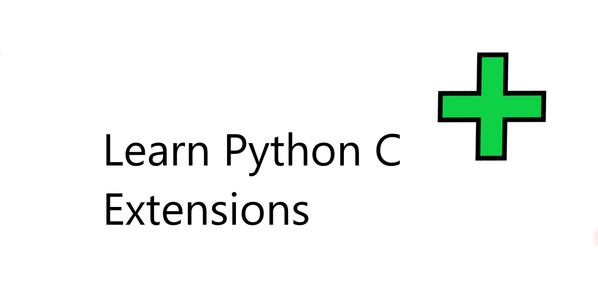

# PyCExtension




## Intro

Python is one of the world's most popular programming languages. C is a super fast, older language
that inspired the syntax and protocols of many languages in use today. They are both powerful languages,
but using them together brings unparalleled performance and simplicity to the playing field.

This is a guide to learn how to write, build, and ship Python C Extensions. It assumes some programming experinece
with both Python and `C`. At the end of this guide, you will be able to make a small extension module that can process
small values as input like this:

```py
>>> import DemoPackage
>>> DemoPackage.print_message("hello!")
printer hello!
```

The repo also serves as a template for starting Python C extension packages. It has the entire setup
to build and develop a C extension you can publish to the Python package index.

### Why make a C Extension?

C extesnions are fast, performant python libraries that can serve several purposes. Those include:

#### `High Performance`: 

C extensions can perform hundreds of times faster than equivalent code written in Python. 
This is because c functions are natively compiled, and just a thin layer over assembly code. Additionally, some
tasks can be slower to perform in Python, such as string processing. Python has no concept of a character, just strings of different lengths.
While C, has a very raw and effecient string composed purely of a block of memory terminated with a `\0` character. Overall,
C extensions provide a way to gain a powerhouse of performance in Python.

#### `Wrapping`:

Lots of widely used software libraries are written in C. However, many application level systems, like web development
framewroks, or mobile development frameworks, are written in languages like Java or Python. C functions can't be
called directly from Python, because Python does not understand C types without converting them to Python types. 
However, extensions can be used to wrap C code to make it callable from Python. The building and parsing of Python
types will be explained later.

#### `Low Level Tools`:

In Python, the degree to which one can utilize low level and operating system level utilities is 
quite limited. Python uses a Global Interpreter Lock (GIL), that allows only one thread at a time to execute
Python bytecode. This means that although some I/O bound tasks like file writes or network requests can
happen concurrently, access to Python objects and functions cannot.

With C, a program has complete and unrestricted freedom to any resources it can load and use. In a C extension,
the `GIL` can be released, allowing for multi-threaded python work flows.

## The Python C API

The Python language provides an extensive C API that allows you to compile and build C functions that
can accept and process Python typed objects. This is done through writing a special form of a C library,
that is not only linked with the Python libraries, but creates a *module object* the Python interpreter imports
like a regular Python module.

Before we get into the building steps, lets understand how a C function can process Python objects as input
and return Python objects as output. Let's look at the function below:

```c
#include <Python.h>

static PyObject* print_message(PyObject* self, PyObject* args)
{
    const char* str_arg;
    if(!PyArg_ParseTuple(args, "s", &str_arg)) {
        puts("Could not parse the python arg!");
        return NULL;
    }

    printf("msg %s\n", str_arg);
    // This can also be done with Py_RETURN_NONE
    Py_INCREF(Py_None);
    return Py_None;
}
```

The type, `PyObject*`, is the *dynamic* type that represents any Python object. You can think of it like a
base class, where every other Python object, like `PyBool` or `PyTuple` inherits from `PyObject`. The C
language has no *true* concept of classes. Yet, there are some tricks to implement an inheritance, polymorphic like system.
The details of this are beyond the scope of this guide, but one way to think about it is this:

```c

#define TYPE_INFO int type; \
                  size_t size

struct a_t {
    TYPE_INFO;
};

struct b_t {
    TYPE_INFO;
    char buf[20];
};

struct b_t foo;
// Fields are always ordered, this will work
((struct a_t*)&foo)->type
```

In the above example, both `a_t` and `b_t` share the same fields at the beginning of their definitions. This means, casting `struct b_t*` to
`struct a_t*` works because the fields of `a_t` compose the same, prefixed portion of `b_t`.

### Parsing Arguments

The function has to parameters, `self` and `args`. For now, think of `self` as the object at which the function is called from.
As stated in the beginning, we will be writing our function to be called from the scope of the module.

The function parses the objects within `args` in this statement:

```c
if(!PyArg_ParseTuple(args, "s", &str_arg)) {
```

Here, the `args` parameter is actually a `PyTuple`, the same thing as a tuple in Python, such as 
`x = (1, 2)`. In the case of a normal function call in Python, with no keyword args, the arguments are packed
as a tuple and passed into the corresponding C function being called. The `"s"` string is a format specifier.
It indicates we expect and want to extract one `const char*` as the first and only argument to our function.
More information on [parsing Python C arguments](https://docs.python.org/3/c-api/arg.html).

### Returning Values

In the last part of the function, we have the following statements

```c
    Py_INCREF(Py_None);
    return Py_None;
```

In the Python C API, the `None` type is represented as a singleton. Yet, like any other `PyObject`, we have
to obey it's reference counting rules and accurately adjust those as we use it. Other C Python functions 
may build and return other values. For more info on building values, [see here](https://docs.python.org/3/c-api/arg.html#building-values)

This particular function is only meant to print, by convention those usually return `None`.

## C Extensions Structure

Now, we can explore the structure of how we compose the extensions that Python will actually be
able to import and use within the Python runtime. To do that, we need three things. First is the definition of
all the methods the extension offers. This is an array of `PyMethodDef`, terminated by an empty version of the
struct. Next is the module definition. This basically titles the module, describes it, and points to our
list of method definitions. Just like in pure Python, everything in an Extension is really an object. Lastly,
we have a `PyInit_` method that initializes our module when it's imported and creates the module object:

```c
static PyMethodDef myMethods[] = {
    { "print_message", print_message, METH_VARARGS, "Prints a called string" },
    { NULL, NULL, 0, NULL }
};

// Our Module Definition struct
static struct PyModuleDef myModule = {
    PyModuleDef_HEAD_INIT,
    "DemoPackage",
    "A demo module for python c extensions",
    -1,
    myMethods
};

// Initializes our module using our above struct
PyMODINIT_FUNC PyInit_DemoPackage(void)
{
    return PyModule_Create(&myModule);
}
```

*Note: The name in the PyInit_ function and the name in the module definition MUST match.*

This code, along with our previous `print_message` function should be placed in a single C file.
That C file can be built into a C Extension with a special `setup.py` file. Below is an example, 
which is also included in this repo:

```py
from distutils.core import setup, Extension

# A Python package may have multiple extensions, but this
# template has one.
module1 = Extension('DemoPackage',
                    define_macros = [('USE_PRINTER', '1')],
                    include_dirs = ['include'],
                    sources = ['src/demo.c'])

setup (name = 'DemoPackage',
       version = '1.0',
       description = 'This is a demo package',
       author = '<first> <last>',
       author_email = 'person@site.com',
       url = 'https://docs.python.org/extending/building',
       long_description = open('README.md').read(),
       ext_modules = [module1])
```

This setup file uses the `Extension` class from `distutils.core` to specify the option, such as
definitions for the C preprocessor, or an include dir to use when invoking the compiler. C extensions 
are always built with the compiler from which the running instance of the python interpreter was
built with. The `Extension` class is very similar to a `CMake` setup, specifying a target, and the options
to build that target with.

In this repo, you will also find a `MANIFEST.in` file. This is to specify other files we want packaged
in the distribution of our Python package. But this is not required, this is only if publishing a C extension
is desired.

### Building and Installing

You can then build and install the extension with the following commands.

 ```
 $ python setup.py build
 $ python setup.py install
 ```